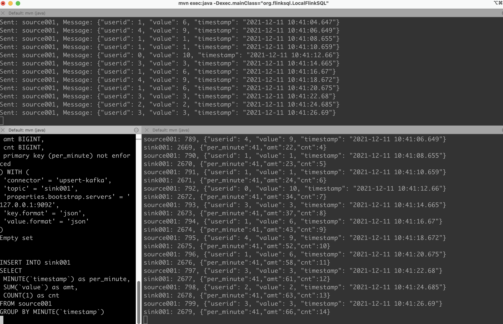

# FlinkSQL Maven Demo

## Deployment

```
# Step1: 
$ docker-compose up -d

# Step2:
$ mvn clean install compile

# Step3:
# run LocalKafkaProducer.java -> topic: source001
$ mvn exec:java -Dexec.mainClass="org.flinksql.LocalKafkaProducer"

# Step4:
# run LocalFlinkSQL.java -> group by -> topic: sink001
# edit resources/running.sql
$ mvn exec:java -Dexec.mainClass="org.flinksql.LocalFlinkSQL" -Dexec.classpathScope=compile

# Step5：
# run LocalKafkaConsume.java -> topic: source001, sink001
$ mvn exec:java -Dexec.mainClass="org.flinksql.LocalKafkaConsume"
```

## Runtime


