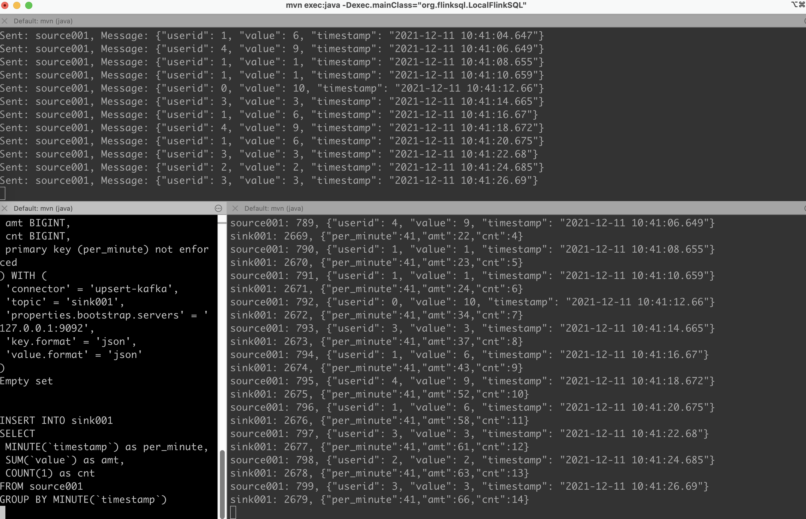
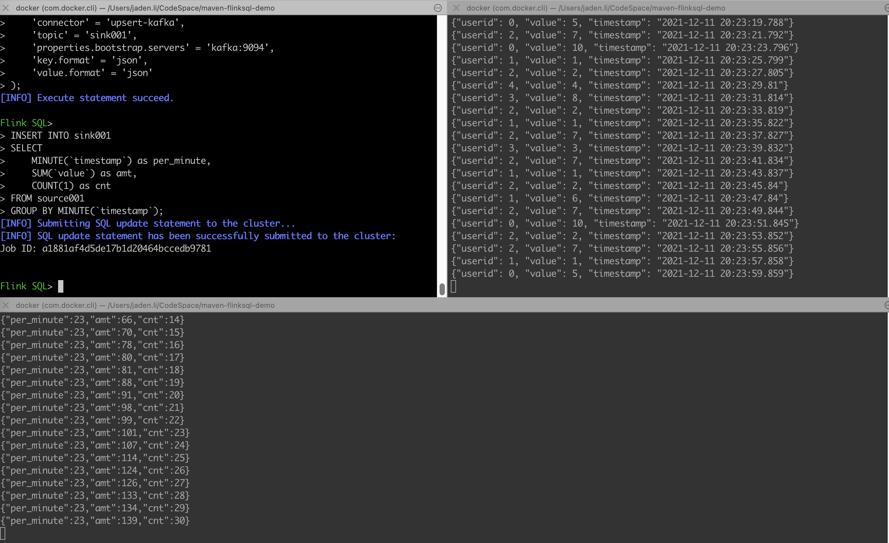
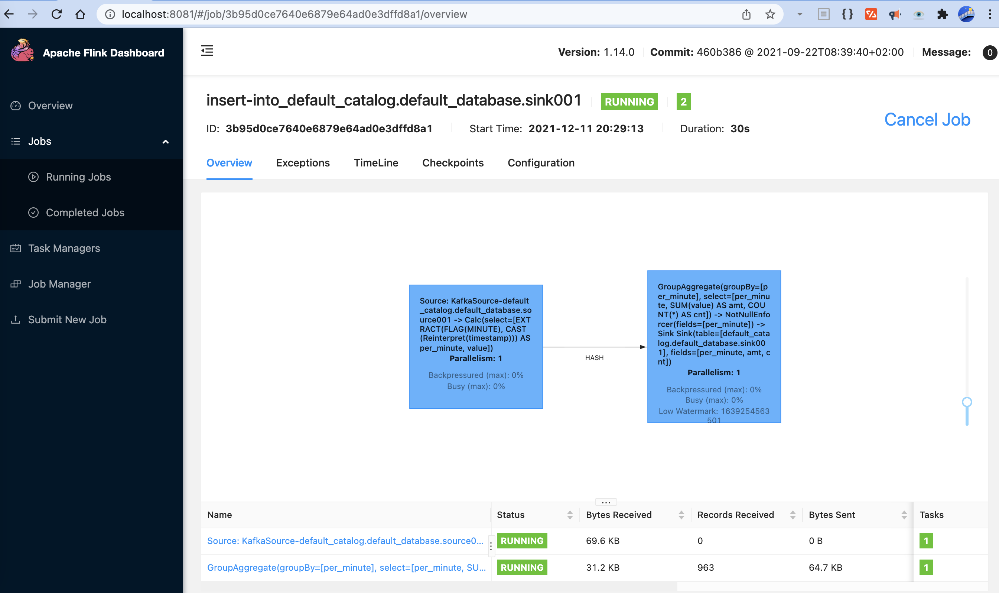

# FlinkSQL Demo

## FlinkSQL Maven Demo

### Independencies

| Service | Runtime | Remark |
|---|---|---|
| Zookeeper | Docker | docker-compose |
| Kafka | Docker | docker-compose |
| Flink | Maven | `mvm` or IntelliJ IDEA |

### Deployment

```
# Step1: 
# startup zookeeper/kafka service
$ docker-compose up -d

# Step2:
$ mvn clean install compile

# Step3:
# startup kafka producer LocalKafkaProducer.java -> topic: source001
$ mvn exec:java -Dexec.mainClass="org.flinksql.LocalKafkaProducer"

# Step4:
# run LocalFlinkSQL.java -> group by -> topic: sink001
# edit resources/MavenRunning.sql
$ mvn exec:java -Dexec.mainClass="org.flinksql.LocalFlinkSQL" -Dexec.classpathScope=compile

# Step5：
# startup kafka consumer LocalKafkaConsumer.java -> topic: source001, sink001
$ mvn exec:java -Dexec.mainClass="org.flinksql.LocalKafkaConsumer"

# or execute kafka commands
$ docker exec -it dfd-kafka /bin/bash -c "kafka-console-consumer.sh --bootstrap-server localhost:9092 --topic source001"
$ docker exec -it dfd-kafka /bin/bash -c "kafka-console-consumer.sh --bootstrap-server localhost:9092 --topic sink001"
```

### Runtime



## FlinkSQL Docker Demo

### Independencies

| Service | Runtime | Remark |
|---|---|---|
| Zookeeper | Docker | docker-compose |
| Kafka | Docker | docker-compose |
| Flink | Docker | docker-compose |

### Deployment

```
# Step0:
# stop zookeeper/kafka service if you executed the above maven demo
$ docker-compose down

# Step1:
# start zookeeper/kafka/flink service
$ docker-compose -f docker-compose-flink.yaml up -d

# Step2:
# run LocalKafkaProducer.java -> topic: source001
$ mvn exec:java -Dexec.mainClass="org.flinksql.LocalKafkaProducer"

# Step3:
# enter flink sql terminal
$ docker exec -it dfd-flink /bin/bash -c './sql-client.sh'

# Step4:
# execute flink sqls one by one
# resources/FlinkRunning.sql

# Step5:
# startup kafka consumer-> topic: source001, sink001
$ docker exec -it dfd-kafka /bin/bash -c "kafka-console-consumer.sh --bootstrap-server localhost:9092 --topic source001"
$ docker exec -it dfd-kafka /bin/bash -c "kafka-console-consumer.sh --bootstrap-server localhost:9092 --topic sink001"

# or execute `mvn` commands startup kafka consumer LocalKafkaConsumer.java 
$ mvn exec:java -Dexec.mainClass="org.flinksql.LocalKafkaConsumer"

# Step6:
# visit flink jobs web 
# http://localhost:8081
```

### Runtime





## Docker Images

- Flink, [DockerHub](https://hub.docker.com/repository/docker/imjaden/flink), [Github](https://github.com/imjaden/docker-flink)
- Kafka, [DockerHub](https://hub.docker.com/repository/docker/imjaden/kafka), [Github](https://github.com/imjaden/docker-kafka)
- Zookeeper, [DockerHub](https://hub.docker.com/repository/docker/imjaden/zookeeper), [Github](https://github.com/imjaden/docker-zookeeper)
